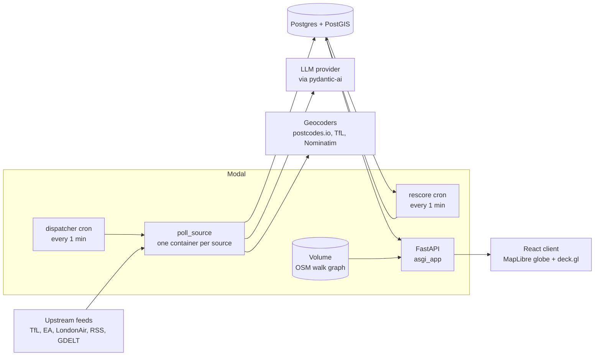
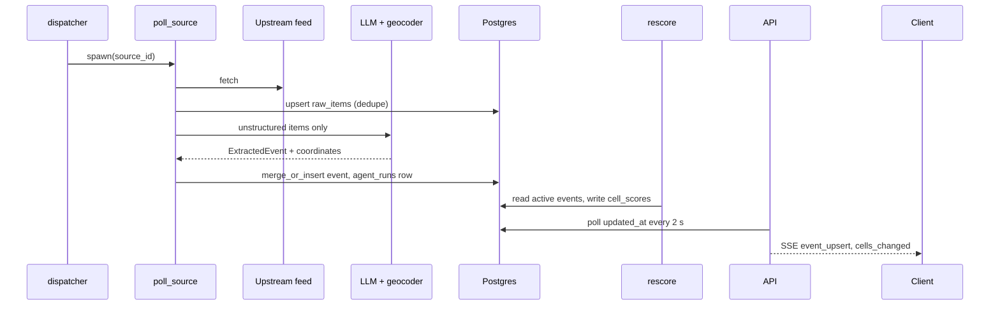

# London Live Risk Map — System Architecture

2026-09-19

## Overview

Polling agents on Modal write geo-located London events into one Postgres/PostGIS database; a scoring job converts them into time-decaying risk per H3 cell; a FastAPI service serves cells and events to a deck.gl globe. Risk-weighted walking routes are phase 2 and reuse the same cell scores.

Scope is Greater London, bbox -0.5104, 51.2868, 0.3340, 51.6919. All data is real; nothing is hardcoded. Full detail is in `SPEC.md` in the repo.

Decisions to confirm:

| Topic | Choice | Reason | Alternative |
| --- | --- | --- | --- |
| Agent runtime | Modal scheduled functions | Your choice | None |
| Scheduling | One dispatcher cron reads a `sources` table and spawns one poll per due source | Modal free plan limits the number of crons (5, unverified); intervals become data | One cron per source |
| Database | Hosted Postgres + PostGIS (Supabase or Neon) | Must be reachable from Modal; spatial queries needed | `modal.Dict` (no queries, no history) |
| Spatial key | H3: events at res 10, scores at res 9 (\~175 m edge) and res 7 (\~1.2 km edge); computed in Python, stored as text | No dependency on the `h3-pg` extension | PostGIS grid, geohash |
| LLM layer | `pydantic-ai`, model set by env var `LLM_MODEL` | Provider-agnostic, returns validated Pydantic objects | Hand-written adapters per provider |
| Coordinates | From a geocoder, never from the LLM | LLM coordinates are unreliable | Trust LLM lat/lng |
| Backend | One FastAPI app on `modal.asgi_app` | Same language as agents and scoring | Separate Express server |
| Globe | deck.gl on MapLibre v5 globe projection, keyless basemap | Your choice; no billing account | CesiumJS + Google 3D Tiles |
| Live updates | SSE, client falls back to 15 s polling | Simple; Modal connection limits unverified | WebSocket, Supabase Realtime |

## Components

The database is the only shared state. Agents write to it, the scoring job reads and writes it, and the API only reads it (except `/api/inject`).



The dispatcher spawns polls; each poll fetches one feed, optionally calls the LLM and geocoder, and writes events. The Volume is used only by phase 2 routing.

| Component | Responsibility | Code |
| --- | --- | --- |
| dispatcher | Select sources where `now - last_polled_at >= poll_interval_s`; call `poll_source.spawn` for each | `backend/app.py` |
| poll\_source | Fetch, store raw items, convert to events, merge or insert, log the run | `backend/app.py`, `backend/sources/*` |
| rescore | Compute `cell_scores` from active events and the baseline; mark decayed events inactive | `backend/scoring.py` |
| API | Read endpoints, SSE stream, manual inject, routing | `backend/api.py` |
| Client | Globe, layers, event feed, agent fleet panel, filters, time slider | `web/` |

## Data flow

A new upstream item reaches the globe in at most about 2 minutes plus the source's poll interval: up to 1 minute for the dispatcher, up to 1 minute for rescore, then the next SSE tick (2 s).



Structured sources (TfL, EA floods, LondonAir) skip the LLM step and map fields directly. Raw payloads are always stored, so extraction can be re-run after a prompt change without re-fetching.

## Agent fleet

Each source is one Python module with two functions, `fetch(cursor) -> list[RawItem]` and `to_event(raw) -> Event | None`, plus one row in the `sources` table. Adding a source means adding a module and a row; no scheduler change.

Endpoint status was checked from the dev machine on 2026-09-19.

| Source | Type | Poll interval | LLM | Checked | Produces |
| --- | --- | --- | --- | --- | --- |
| TfL road disruptions | Structured | 2 min | No | 200 | Closures, works, collisions with point and severity |
| TfL line and stop disruptions | Structured | 2 min | No | 200 | Station closures, severe delays |
| Environment Agency floods | Structured | 5 min | No | 200 | Flood warnings with area polygons |
| LondonAir | Structured | 30 min | No | 200 | Air quality index per site, events only at index 4+ |
| Open-Meteo | Structured | 15 min | No | 200 | City-wide modifier for high gusts or heavy rain |
| police.uk | Structured, one-off backfill | Monthly | No | 200, latest month 2026-07 | Baseline crime density per cell, not live events |
| BBC London RSS | Unstructured | 5 min | Yes | 200 | Located incidents from news |
| GDELT | Unstructured | 1 min at most | Yes | 429 when called twice in 5 s | Wider news coverage |
| Met Police news | Unstructured | 10 min | Yes | 404 on the tried URL; correct feed to be found | Official incident statements |

Three agent types:

- **Structured pollers** map upstream fields to events with fixed rules. The upstream id is the event identity, and an event is marked `ended` when it leaves the feed.
- **Extraction agents** send each new article to the LLM, which returns `ExtractedEvent` or nothing. The output contains a place description (`place_text`, `place_kind`) and a severity, never coordinates or confidence.
- **Corroboration agent** (stretch) web-searches high-severity events that have a single source and adjusts confidence.

Geocoding order: UK postcode via postcodes.io, station names via TfL StopPoint search, otherwise Nominatim limited to the London bbox at 1 request/s. Results are cached in `geocode_cache`. Results outside the bbox are rejected. A borough-only match gets a large radius and low confidence. No resolvable place means no event.

Not used: X/Twitter geo posts (no affordable read access, under 2% of posts are geotagged), VIIRS night lights (about 500 m pixels), police dispatch feeds (none exist for London).

## Database

Seven tables in one Postgres database with PostGIS. Every event carries a PostGIS geometry for exact spatial queries and three H3 indexes for aggregation and fast lookups.

| Table | One row per | Key columns | Written by |
| --- | --- | --- | --- |
| `sources` | Feed | `id`, `kind`, `poll_interval_s`, `enabled`, `last_polled_at`, `last_status`, `cursor` | Seed script, poll\_source |
| `raw_items` | Fetched upstream item | `source_id`, `external_id` (unique together), `payload` jsonb, `processed` | poll\_source |
| `events` | Deduplicated incident | `category`, `geom`, `centroid`, `radius_m`, `h3_r10`, `h3_r9`, `h3_r7`, `severity`, `confidence`, `half_life_min`, `occurred_at`, `ended`, `source_ids[]`, `urls[]` | poll\_source, `/api/inject` |
| `baseline_cells` | H3 cell | `crime_rate` 0..1, `lit_fraction` | police.uk backfill, OSM import |
| `cell_scores` | H3 cell and resolution | `live`, `baseline`, `score`, `top_event_ids[]`, `updated_at` | rescore |
| `agent_runs` | Poll execution | `source_id`, `started_at`, `finished_at`, `fetched`, `inserted`, `merged`, `llm_calls`, `error` | poll\_source |
| `geocode_cache` | Place query | `query`, `lat`, `lng`, `precision_m`, `provider` | geocoder |

Indexes: GiST on `events.geom`, btree on `events.h3_r9` and `events.occurred_at`. Severity and confidence are stored in \[0, 1\]. All timestamps are `timestamptz` in UTC.

Events are never deleted. Decayed or ended events stay for the time slider and for history; rescore ignores them.

## Scoring and merging

Every score is in \[0, 1\], and a cell's score cannot exceed 1 regardless of how many events overlap it.

Event risk at time t. For events with an active upstream state (road closures, flood warnings) the decay term is 1 until the event is marked ended.

```latex
r_i(t) = s_i \cdot c_i \cdot 0.5^{(t - t_i)/h_i}
```

Spatial weight of event i on cell c, where d is the distance from the cell centre to the event geometry and R is the event radius:

```latex
w_i(c) = \max\left(0,\ 1 - \frac{d_i(c)}{R_i}\right)
```

Live score, then the combined score with baseline weight k = 0.4:

```latex
\mathrm{live}(c) = 1 - \prod_i \bigl(1 - r_i(t)\, w_i(c)\bigr), \qquad \mathrm{score}(c) = 1 - \bigl(1 - \mathrm{live}(c)\bigr)\bigl(1 - k\,\mathrm{baseline}(c)\bigr)
```

Events with risk below 0.05 are excluded. Resolution 7 scores are the mean of their resolution 9 children.

| Category | Half-life (min) | Default radius (m) |
| --- | --- | --- |
| violent\_crime | 180 | 250 |
| disorder | 90 | 300 |
| fire | 120 | 200 |
| air\_quality | 60 | 1000 |
| road\_closure, transit\_disruption | No decay while listed upstream, then 30 | From geometry |
| flood | No decay while the warning is active | Polygon |

Source confidence: official structured feeds 0.95, official statements 0.9, news 0.7, manual inject 0.5.

Merge rule: a new event merges into an existing one when the category group matches, centroids are within the larger of the two radii, and `occurred_at` differs by under 3 hours. On merge, sources and URLs are unioned, confidence becomes 1 minus the product of (1 - c) over distinct sources, and the higher severity and more precise geometry are kept.

## API

One FastAPI app with seven endpoints. Response shapes are generated from the Pydantic models, and the client's TypeScript types are generated from the OpenAPI schema. Coordinates are always GeoJSON order, \[lng, lat\].

| Method | Path | Returns |
| --- | --- | --- |
| GET | `/api/cells?res=&bbox=&min_score=` | List of `{h3, score, live, baseline, top_event_ids}` |
| GET | `/api/events?bbox=&since=&category=&active=` | GeoJSON FeatureCollection; each feature includes current `risk` |
| GET | `/api/events/{id}` | Full event with sources and URLs |
| GET | `/api/agents` | Per source: enabled, interval, last run, last status, counts for the last hour |
| GET | `/api/stream` | SSE messages: `event_upsert`, `event_end`, `cells_changed`, `agent_run` |
| POST | `/api/inject` | Runs the extraction pipeline on submitted text; event is tagged source `manual` |
| POST | `/api/route` | Phase 2: `fast` and `safe` routes with length, duration, mean and max risk |

The stream is implemented by querying `updated_at` every 2 s on the server. No authentication for the hackathon; `/api/inject` gets a shared token so the public URL cannot be used to add events.

## Frontend

React, TypeScript and Vite, with MapLibre GL JS v5 in globe projection as the base map and deck.gl layers drawn on top through `MapboxOverlay`. The view opens on the whole globe and moves the camera to London at about 50° pitch.

| Layer | deck.gl / MapLibre type | Data | Encoding |
| --- | --- | --- | --- |
| Risk cells | `H3HexagonLayer` | `/api/cells`, res 7 below zoom 11, res 9 above | Colour and extrusion height from `score` |
| Events | `ScatterplotLayer` or `IconLayer` | `/api/events` | Icon by category; radius pulse when newer than 10 min |
| Areas and closures | `GeoJsonLayer` | Flood polygons, road closure geometry | Outline and fill by category |
| Buildings | MapLibre `fill-extrusion` | Vector basemap (OpenFreeMap or CARTO dark) | Neutral grey |
| Routes (phase 2) | `PathLayer` | `/api/route` | One colour per route |

Panels: event feed (newest first, click moves the camera), event detail (sources, links, risk-over-time graph), agent fleet status, category filters, a baseline/live/combined toggle, and a 24 h time slider that recomputes decay in the browser from stored event fields.

State: TanStack Query for fetches, one `EventSource` for the stream, no global state library.

## Phase 2: routing

Routing runs server-side with Dijkstra on an OpenStreetMap walking graph, using the current `cell_scores` as edge weights, so routes change as events arrive.

- Graph: OSMnx `network_type="walk"` for inner London, bbox -0.26, 51.45, 0.02, 51.57. Built once offline and stored in a Modal Volume. Each edge is precomputed with the res 9 cells it passes through and a `lit` flag from OSM tags.
- Per request: one query loads cell scores for the route bbox; two shortest-path runs produce `fast` (alpha 0, beta 0) and `safe` (user alpha).
- The API container keeps the graph in memory with `min_containers=1` to avoid a load on each request.

Edge cost is a product of positive factors, so it is always above zero and Dijkstra stays valid. risk(e) is the maximum score of the cells the edge passes through; alpha is a user slider in \[0, 10\]; beta is 0.15; lit(e) is 0 or 1.

```latex
\mathrm{cost}(e) = \mathrm{length}(e)\,\bigl(1 + \alpha\,\mathrm{risk}(e)\bigr)\,\bigl(1 - \beta\,\mathrm{lit}(e)\bigr)
```

## Deployment and open risks

Three deployables: the Modal app (`modal deploy backend/app.py`: two crons, `poll_source`, the API), the hosted Postgres database, and the static web build (any static host; Vercel or Netlify). Local development uses `modal serve` and `npm run dev` against the same database.

One Modal secret, `london-risk`: `DATABASE_URL`, `LLM_MODEL`, the matching provider API key, `INJECT_TOKEN`, optional `TFL_APP_KEY`.

| Risk | Effect if it fails | Check or mitigation |
| --- | --- | --- |
| deck.gl layers on MapLibre globe projection | Hexagons misplaced or not drawn | Test first, before any other frontend work. Fallback: deck.gl `_GlobeView` with a raster basemap |
| Modal cron count and long-lived SSE connections | Scheduler or stream design changes | Verify on the actual plan. Design needs only 2 crons; client already falls back to polling |
| Geocoding accuracy for news text | Events at wrong locations | Precision sets radius and confidence; discard unresolved places; 20-article fixture test |
| No live police feed for London | Live layer is mostly transport, roads, floods, air quality | Crime comes from news extraction plus the police.uk baseline; more local RSS feeds add volume |
| Nominatim policy, 1 request/s | Throttling or a block | Cache every result; postcodes.io and TfL search are tried first |
| LLM cost and latency | Slow or expensive polls | Only new unstructured items reach the LLM; small model by default; raw items stored for re-runs |
